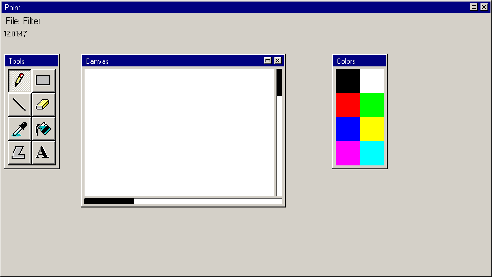

# UI-System


Retro-style image editor with plugin system





## Functionality


Features:
- Open/Save images
- Multiple images can be opened
- 8 predefined tools
- 5 predefined filters
- 8 predefined colors
- Built-in clock for time management


Main feature is plugin system, that allowes attaching unlimited amount of new tools and filters to application.


## Build


*This build is Linux only. Other OS are not supported.*

Download repository first, then run commmand

```sh
make
```

and execute 'run.out'


## License


MIT
